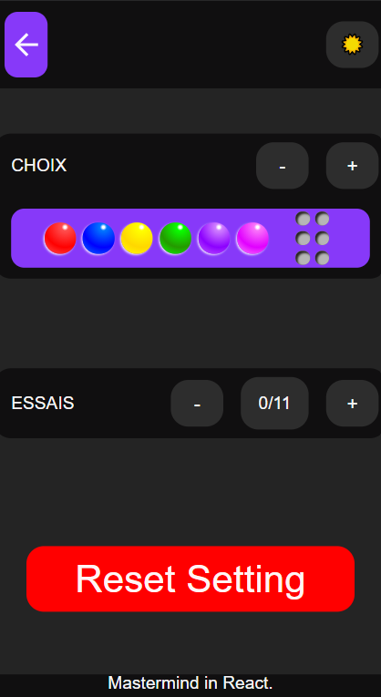

# Mastermind :large_blue_circle: :white_circle: :red_circle:

## Why ?
Just a Mastermind Game to practice react.js, redux RTK, styled-components, localStorage and have fun while coding. 

Let's Play [Mastermind-React Online](https://mastermind-react.netlify.app/infos)

## Photos

## Hosted on Netlify

This project was bootstrapped with [Create React App](https://github.com/facebook/create-react-app), using the [Redux](https://redux.js.org/) and [Redux Toolkit](https://redux-toolkit.js.org/) template.
